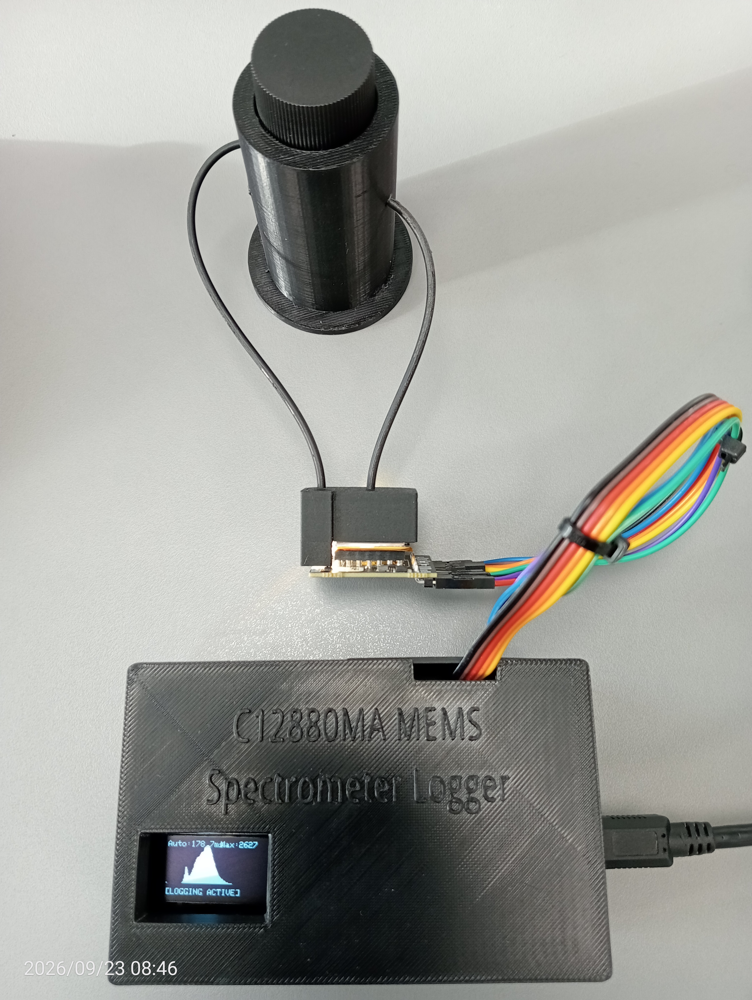
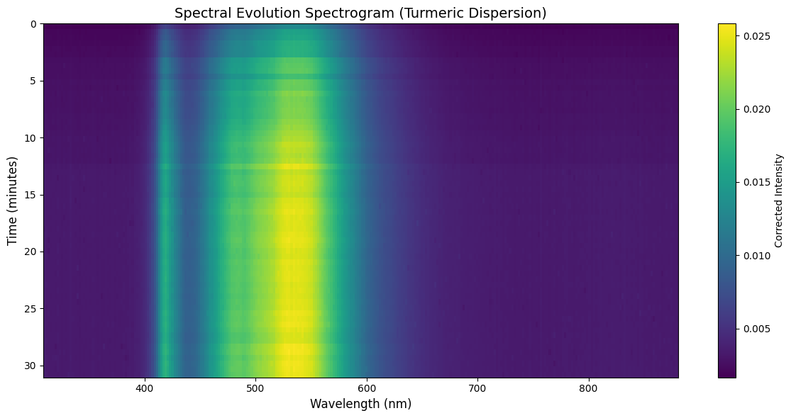
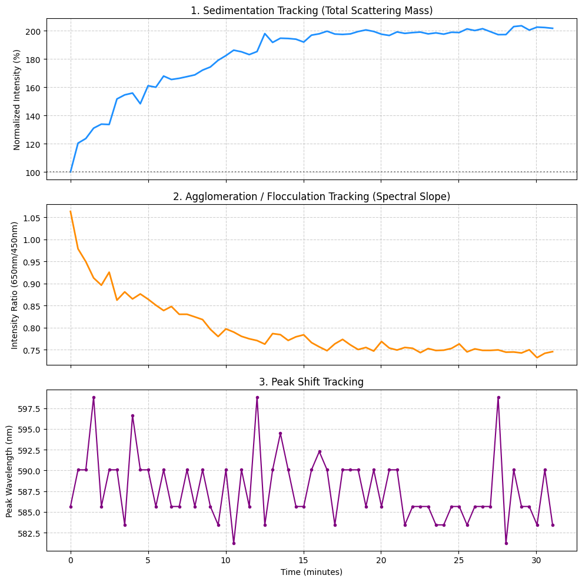
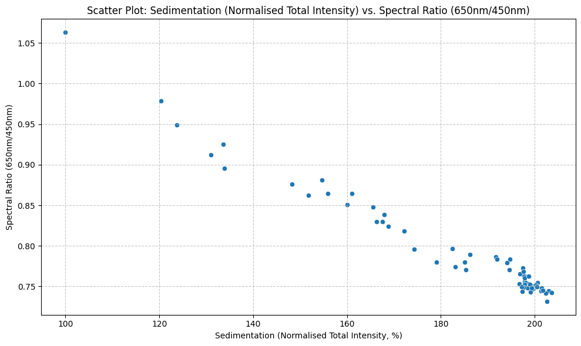

# Multiwavelength Dispersion Analyser

A low-cost, highly portable optical sensing platform designed for field and lab use, pairing the **Hamamatsu C12880MA micro-spectrometer** with its **onboard PCB LED illumination source** to track stability, flocculation, agglomeration, and sedimentation dynamics in complex liquid dispersions.

Traditional stability analysers rely on single-wavelength light sources and a single photodiode, capturing only a blunt aggregate transmission number. This project evolves that proven industrial concept into a full-spectrum (340 - 850 nm) optical tool. By monitoring every wavelength simultaneously, the system can decouple overall scattering mass from time-dependent particle size shifts, micro-bubble relaxation phases, and differential sedimentation.

---

## System Architecture & Field Portability

Engineered for rapid deployment outside the traditional laboratory, the device combines low-power microcontrollers with precision optical hardware:

* **0° Transmission & Extinction Axis:** The primary operational path, tracking total optical density, scattering, and initial de-aeration/bubble-clearing behaviour immediately after sample agitation.
* **Multi-Angle Optical Probing:** Configurable housing geometry designed to capture multiwavelength extinction and scattering profiles across the entire visible-to-near-infrared spectrum.

---

## Sensor Layout & Dark Pixel Reference

The Hamamatsu C12880MA sensor array comprises 288 total channels. The 288-pixel spectral detector provides a full 340–850 nm spectral measurement at approximately 12 nm FWHM resolution. The first 87 columns (**P0 through P86**) correspond to a dedicated sequence of physically shielded pixels on the sensor die. 

Rather than relying on an isolated external reference, these masked elements capture the sensor's native dark current, reset noise, and electronic baseline offsets in real time. The firmware uses this continuous block for thermal drift and offset subtraction on every individual scan, ensuring high repeatability in field conditions.

---

## Hardware Bill of Materials

* **Micro-Spectrometer & Light Source:** Hamamatsu C12880MA micro-spectrometer module utilising its **onboard PCB LED** as the illumination source (288-pixel CMOS image sensor with a reflection grating, 340 - 850 nm range; features 87 optically shielded dark pixels, P0 - P86, for real-time baseline noise subtraction).
* **Microcontroller:** ESP32 Dev Module (handling precise clock timing, ADC attenuation, OLED interface, and SD card logging).
* **Housing:** Custom 3D-printed matte black, lightweight portable enclosure optimised for standard optical vials/cuvettes and secure alignment with the spectrometer PCB.

---

## Dispersion Physics & Kinetic Analysis Pipeline

By capturing full-spectrum temporal data (e.g., minute-by-minute logs of shaken suspensions like turmeric or starch in water), the companion Python and firmware tools extract rich kinetic metrics underpinned by fundamental optical scattering and fluid dynamics principles:

1. **Sedimentation Tracking (Total Scattering Mass & Stokes' Law):** 
   * Monitors the total integrated intensity across all active wavelengths to evaluate overall suspended particle mass in real time.
   * Captures initial preparation artefacts, such as micro-bubble clearance and de-aeration phases immediately following sample agitation.
   * Reflects bulk particle concentration changes governed by gravitational settling dynamics (approximate Stokes' settling), where particle size, mass density differentials, and fluid viscosity dictate how matter migrates relative to the optical path.

2. **Agglomeration & Flocculation Tracking (Mie vs. Rayleigh Scattering & Spectral Slope Ratios):** 
   * Computes multiwavelength intensity ratios (e.g., $650\text{nm} / 450\text{nm}$) to detect continuous changes in spectral tilt and slope as particles interact and evolve.
   * **Rayleigh Regime ($d \ll \lambda$):** Applies when scattering particles are significantly smaller than the incident wavelength (typically $d < \lambda / 10$). Here, scattering efficiency scales steeply with the inverse fourth power of wavelength ($\lambda^{-4}$), causing much stronger scattering at shorter wavelengths (blue/UV) than longer wavelengths (red/NIR).
   * **Mie Regime ($d \approx \lambda$):** Applies when particle diameters are comparable to the wavelength of light, which is characteristic of practical suspensions, emulsions, and colloidal dispersions (such as starch or turmeric granules). In this regime, the wavelength dependence becomes much weaker and non-monotonic, scaling inversely with $\lambda$ to a lower power or exhibiting complex resonance patterns.
   * **Tracking Agglomeration:** By measuring how the full spectrum shifts across these optical regimes, the system isolates differential sedimentation and flocculation, revealing how heavier or coarser aggregates drop out rapidly while finer fractions remain suspended or form loose structural clusters that alter the wavelength-dependent scattering profile.

3. **Peak Wavelength & Structural Shape Shifts:** 
   * Identifies discrete shifts, broadening, or fluctuations in maximum scattering peaks over extended time series.
   * Decouples bulk chemical identity and baseline intensity changes from physical structural modifications, confirming whether the primary scattering centre remains stable while localised clustering, swelling, or spatial redistribution occurs within the dispersion.

---

## Firmware & Field-Ready Data Logging

The companion ESP32 firmware features an interactive serial interface supporting deployment in the field:
* **Real-Time Auto-Exposure:** Automatically scales integration time (11 ms to 1 s) to keep peak ADC values within optimal target bounds.
* **Periodic Interval Datalogging (`LOG <sec>`):** Automatically saves timestamped spectral frames to an attached SD card at user-defined intervals (ideal for tracking long-term stability curves over 30 to 60+ minutes).
* **Burst Capture (`B`):** Rapidly captures a RAM buffer following a pre-flight auto-exposure stabilisation phase.
* **Metadata Tagging (`COMMENT <text>`):** Appends custom text tags directly to log entries for field sample tracking.

## Experimental Results

To validate the multiwavelength pipeline under real-world conditions, a dynamic stability test was performed using a turmeric-in-water dispersion over a 36-minute time series. Following manual agitation, the sample was logged continuously to capture both transient mixing artifacts and long-term suspension relaxation.

### 1. Raw Spectral Evolution: Waterfall & Spectrogram View
The initial optical behavior of the dispersion is captured across the raw spectral response. 

 

---

* **What we are seeing:** The raw waterfall/overlay plot above demonstrates the complete spectral signature captured by the Hamamatsu C12880MA spectrometer, ranging from the UV-visible cutoff through the characteristic curcuminoid absorption and scattering bands (peaking around 560 – 590 nm). 
* **Connection to the Pipeline:** This corresponds directly to the raw data input stage of our pipeline. Unlike a single-wavelength sensor that only logs a single scalar value, this full spectral sweep captures the entire optical envelope at every 60-second time step. The dense vertical lines visible in early iterations highlight how the hardware pixel resolution responds across the spectrum before baseline dark-correction is applied.

---

### 2. Kinetic Breakdown & Multi-Parameter Analysis

To understand the physical phenomena occurring inside the vial, the raw spectra were processed through the multiwavelength analytical framework, yielding three distinct diagnostic time profiles. The dispersion stability analysis provides insights into how the sample's spectral properties change over time, indicating potential physical processes like sedimentation, agglomeration, or flocculation.

* **Important Context:** The dispersion was shaken before logging, which influences initial spectral readings due to temporary air bubbles and increased initial homogeneity. After the logging run, sedimentation of particles was observed at the bottom of the vial.

### Panel 1: Sedimentation Tracking (Total Scattering Mass)
* **What it shows:** The normalised total integrated intensity starts at a baseline of 100 % and climbs sharply over the first 10 to 15 minutes, reaching ~180 % by minute 10 and stabilising near a plateau of 190 % to 202 % for the remainder of the run.
* **Physics Connection:** This unmasks the micro-bubble clearance phase. Vigorous manual shaking introduces micro-bubbles that severely scatter and block light, artificially depressing the initial transmission signal. As bubbles migrate to the surface and dissipate, the optical path clears, revealing the true underlying scattering behaviour of the suspension mass.

### Panel 2: Agglomeration / Flocculation Tracking (Spectral Slope)
* **What it shows:** The intensity ratio between 650 nm and 450 nm drops rapidly from an initial value of ~1.06 down to ~0.87 within the first 3 minutes, before gradually levelling off into a stable baseline around 0.75 by minute 15.
* **Physics Connection:** This tracks the breakdown and structural relaxation of large, forced agglomerates created during manual mixing. The higher initial slope indicates a heavily skewed scattering profile dominated by large clusters. As these clusters settle or break apart into a more uniform colloidal distribution, the spectral tilt flattens into a steady state.

### Panel 3: Peak Shift Tracking
* **What it shows:** The apex wavelength of the primary dispersion band oscillates within a discrete band between ~581.25 nm and ~598.75 nm, featuring sharp quantisation steps with prominent transient spikes reaching nearly 599 nm at approximately minutes 2, 12, and 27.
* **Physics Connection:** This demonstrates the limits and behaviour of pixel-resolution quantisation on discrete spectrometer arrays. As the true optical peak centre shifts subtly, the algorithm snaps between adjacent physical pixel columns. The larger spikes capture genuine, momentary bulk shifts where transient cluster migrations altered the spectral envelope's center of mass.

### 3. Sedimentation vs. Spectral Ratio

The strong negative Pearson correlation coefficient of -0.9834 observed between normalized total intensity (sedimentation) and the spectral ratio (agglomeration/flocculation) is clearly illustrated in the scatter plot below[cite: 2]. This visualization confirms a robust inverse relationship mapping optical scattering mass against spectral slope dynamics[cite: 2].

#### Correlation Analysis & Physical Coupling
* **Axes & Range:** The plot maps the Normalised Total Intensity (%) from a baseline of 100 % up to approximately 205 % on the x-axis against the 650nm/450nm Spectral Ratio spanning from ~0.74 to 1.07 on the y-axis.
* **Inverse Proportionality:** As the Normalised Total Intensity increases—driven by micro-bubble clearance and enhanced optical path clarity—the Spectral Ratio systematically decreases from an initial peak of ~1.06 down to a stable baseline around 0.74 to 0.75.
* **Physical Significance:** This tight coupling demonstrates that the optical evolution of the dispersion is governed by simultaneous mechanisms: the progressive elimination of scattering obstructions aligns directly with the structural relaxation and breakdown of large particle agglomerates into a stable colloidal state.

